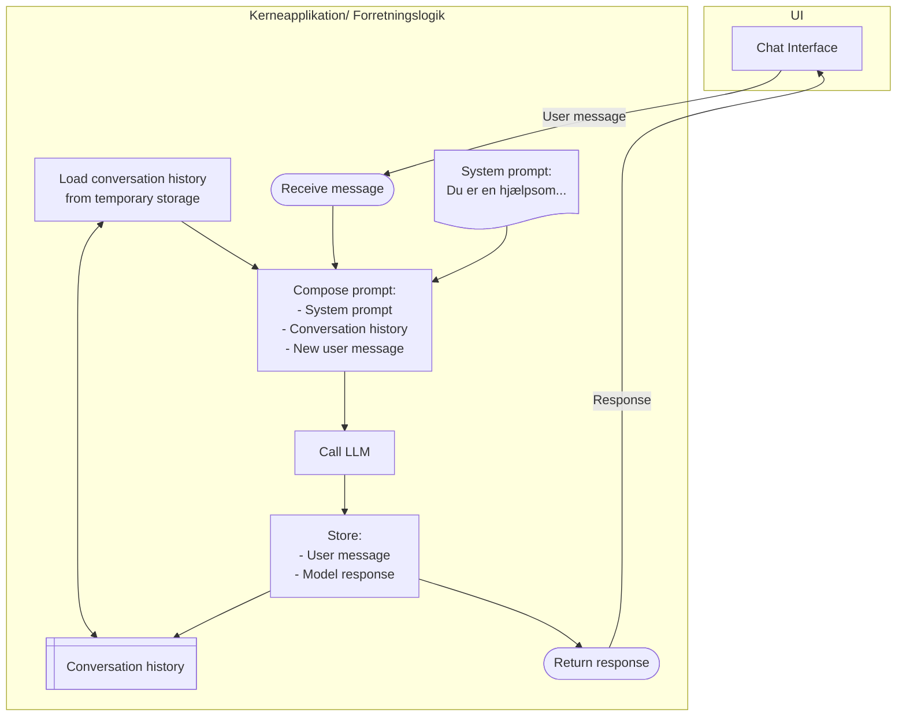

# Simple sprogmodel chat

Det simplest mulige konkrete eksempel på hvordan logikken i en AI løsning kunne se ud. 
Diagrammet skal ses som en eksemplificering af det
[generelle overblik af komponenter i en AI løsning](../baggrund_objekt_for_os2AI.md#ai-løsning)

Her er der hverken rettigheder eller forbindelse til ekstern forretningsdata
og heller ikke nogle test cases eller performance mål (da vi allerede ved at 
en sådan løsning ikke kan bruges til andet end et eksempel)

**Take-away**: Selv i det simpleste tilfælde er en AI model kun en del af en AI løsning.

##TODO: Maybe implement the above in two pseudo code files (`frontend.code` and `backend.code`)... 