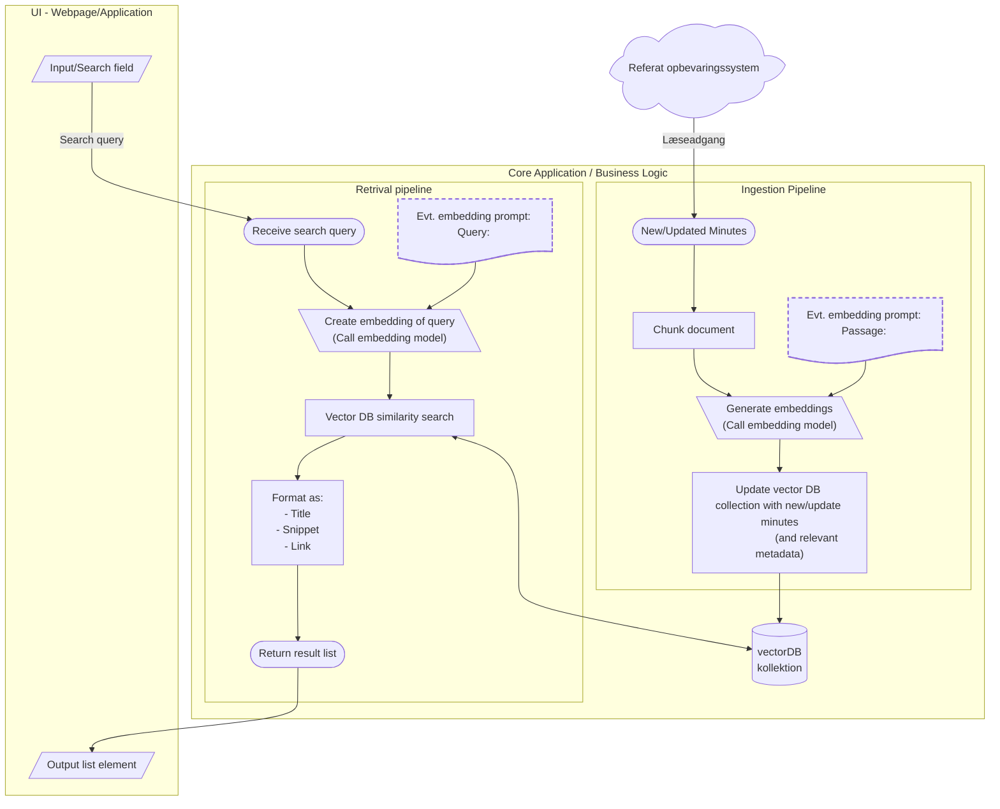

# Søgemoter til byrådsreferater

Et konkret eksempel på hvordan logikken i en AI løsning kunne se ud. Diagrammet skal ses som en eksemplificering af det
[generelle overblik af komponenter i en AI løsning](../baggrund_objekt_for_os2AI.md#ai-løsning)

Eksemplet her er forsimplet i forhold til hvad man i praksis ville være nødt 
til at sætte op. Særligt to ting er meget simplificeret:
- Ingestion flowet, dvs optaget af information i den søgebare database. 
  For at få lidt mere blik for kompleksiteten henvises til [digestion løsningen]
  altså dokument forståelses(/fordøjelses)motoren, som udgør processen indtil 
  information indsættes i vektordatabasen.
- Fremsøgningen, hvor den nuværende state-of-art tilsiger en mere agentisk tilgang, 
  hvor en seperat sprogmodel vurdere hvad en god søgestreng ville være og evt. kan 
  prøve at modificerer denne, hvis den ikke vurdere at de umiddelbare resultater
  svarer på brugeren forespørgsel.

