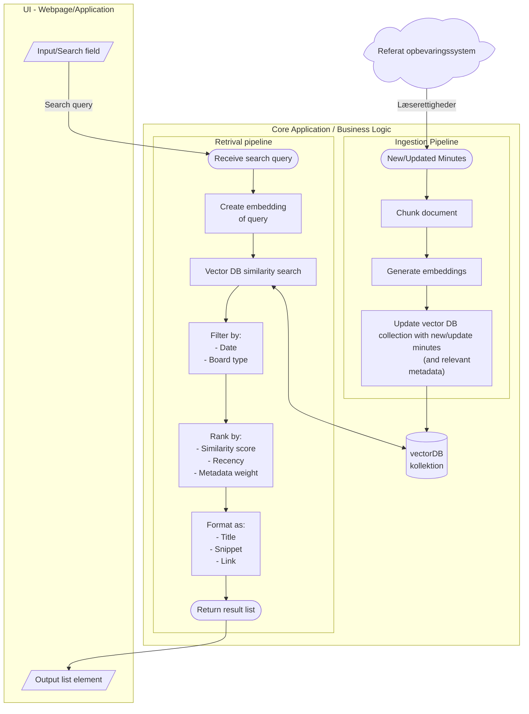

# Søgemoter til byrådsreferater

Et konkret eksempel på hvordan logikken i en AI løsning kunne se ud. Diagrammet skal ses som en eksemplificering af det
[generelle overblik af komponenter i en AI løsning](../baggrund_objekt_for_os2AI.md#ai-løsning)

