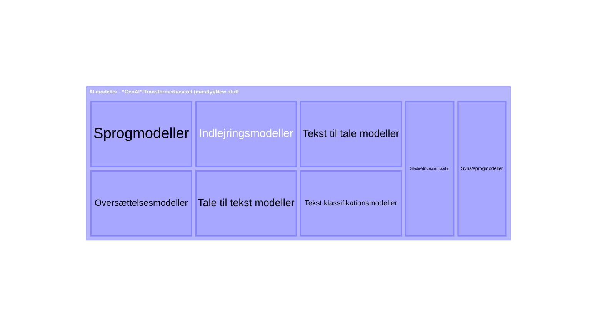

# Baggrund: Objekt for os2AI

_Formålet med dette skriv er at sætte en ramme for en diskussion hvad vi i os2AI fællesskabet mener når vi snakker om
"AI assistenter"/"AI specialister"/"AI løsninger", som vi gerne vil have at det produkt "os2AI", som vi i fællesskabet
udvikler skal understøtte_

Dette er også tænkt som baggrund for AIStorskala projektets spor 3, hvor der skal sættes minimumskrav til 
_"AI assistenter"_/_"AI specialister"_ (uden at begrebet/objektet er defineret og afgrænset nærmere). Dette skriv er
derfor et forsøg på at sætte en ramme for diskussion af hvordan objektet skal defineres og afgrænses, for derved at 
muliggøre en senere diskussion af minimumskrav til _"AI assistenter"_/_"AI specialister"_/eller-hvad-vi-nu-vil-kalde-det
for at vi meningsfuldt i det offerentlige, særligt kommunale, kan dele disse _"ting"_ med hinanden.

## Hvad dækker "AI" over

_AI_/Kunstig intelligens er et diffust begreb, hvilket gør det essentielt er blive skarpe på hvad vi i os2AI snakker om,
når vi snakker om AI for at undgå at tale forbi hinanden.

AI repræsenterer helt overordnet en underklasse under automatisering. 
AI er kendetegnet ved at [mennesker vurderer](## "dvs den fælles konsensus") at disse automatiseringer emulerer
noget som kun mennesker tidligere har kunnet gøre; eller som mennesker vurdere kræver menneskelig intelligens at udføre.

Da AI netop er en "maskine", vil AI'en demonsterer, at en maskine nu kan udføre de opgaver, som kun mennesker tidligere har 
kunnet udfører og med tiden vil det flytte den generelle konsensus, så det der tidligere blev betragtet som AI ikke 
nødvendigvis længere betragtes som AI og det der betragtes som AI i dag ikke nødvendigvis betragtes som AI om nogle år. 

Alan Türings klassiske karakteritisk af AI er, at hvis et menneske (lad os kalde hende Anne) og en maskine, som Anne 
ikke ved er en maskine (det kan være maskine bliver kaldt Bente i eksperimentet) har mulighed for at inteagere.
Hvis Anne ikke bliver klar over at Bente er er en maskine gennem deres inteaktionen, så besidder Bente, altså maskinen, 
kunstig intelligens. 

I EU definere vi "AI" lidt mindre malerisk jf AI Act'en, som:
> AI-system: et maskinbaseret system, som er udformet med henblik på at
fungere med en varierende grad af autonomi, og som efter idriftsættelsen
kan udvise en tilpasningsevne, og som til eksplicitte eller implicitte mål af
det input, det modtager, udleder, hvordan det kan generere output såsom
forudsigelser, indhold, anbefalinger eller beslutninger, som kan påvirke fy-
siske eller virtuelle miljøer.

## AI modeller

Centralt i diskussion står at AI løsningen, for at kunne kaldes _AI_, et eller andet sted benytter sig af en eller flere 
af de statistiske (maskin lærings-) modeller, der i daglig tale opfattes som _AI_, særligt _Generativ AI_ (vagt 
definineret som noget der _generere_ noget) eller _transformer_ baseret AI. 

> _Transformeren_ er en særlig arkitektur komponent i designet af maskin læringsmodeller, som er meget central i de 
_næsten_ alle moderne tekst genererende modeller (tranformeren bruges dog også i mange andre moderne AI-modeller, der 
ikke på samme måde kan siges at være generative). Transformeren blev defineret i 2018 og ses i udviklingsmiljøet for at 
være kilden til den nuværende AI-hype.

### Oversigt over AI modeller

Min egen top-of-head oversigt over de forskellige typer af moderne (transformer-baseret/generative) AI modeller.

Oversigt fra [huggingfaces klassifikation af modeller](./huggingface_ai_model_oversigt.md)

## AI løsning

_Her giver jeg mit personlige bud på hvad der udgør en AI løsning_

Det er essentielt at holde sig for øje at en AI løsning er meget mere end en AI model - uanset hvad man kalder den og 
hvordan vi senere afgrænser den undergruppe af løsninger vi vil beskæftige os med. 

- En AI løsning består af en kerne-applikation, der afspejler den forretningsgang den skal understøtte (eller udfører)
  - Kerne-applikation udgøres af den (maskinlæsbare) logik der implementere _forretnings_logikken
  - Alt efter hvordan det er nødvendigt, håndterer logikken kald af AI modeller, (vectordatabase) opslag, sammensætning 
    af prompts og hvad der ellers er nødvendigt for at løse usecasen i henhold til de kvalitetskrav der er sat
- Kerne-applikationen skal have et input og leverer et output
- Input og output kan komme fra og gå til en brugerflade
- Inputs kan også trigges af event i systemer
- Output kan også trigge ændringer i systemer

Da en moderne AI løsning ikke er umiddelbart gennemskuelig - i mange tilfælde vil samme input ikke nødvendigvis give 
samme output - er en AI løsning også defineret af de performance krav der er stillet til den og i høj grad hvordan man
har testet at løsningen lever op til de krav. Dette er essentiel information, hvis andre også skal kunne vurdere om de 
kan tage løsningen i brug.

