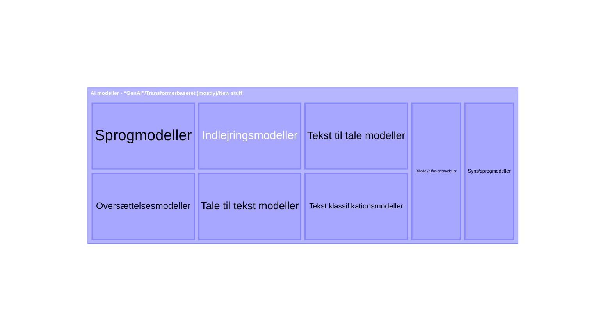
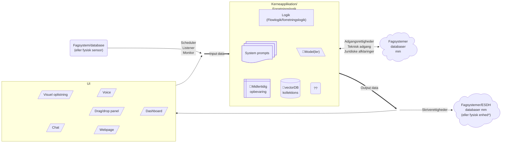

# Baggrund: Objekt for os2AI

_Formålet med dette skriv er at sætte en ramme for en diskussion hvad vi i os2AI fællesskabet mener når vi snakker om
"AI assistenter"/"AI specialister"/"AI løsninger", som vi gerne vil have at det produkt "os2AI", som vi i fællesskabet
udvikler skal understøtte_

Dette er også tænkt som baggrund for AIStorskala projektets spor 3, hvor der skal sættes minimumskrav til 
_"AI assistenter"_/_"AI specialister"_ (uden at begrebet/objektet er defineret og afgrænset nærmere). Dette skriv er
derfor et forsøg på at sætte en ramme for diskussion af hvordan objektet skal defineres og afgrænses, for derved at 
muliggøre en senere diskussion af minimumskrav til _"AI assistenter"_/_"AI specialister"_/eller-hvad-vi-nu-vil-kalde-det
for at vi meningsfuldt i det offerentlige, særligt kommunale, kan dele disse _"ting"_ med hinanden.

## AI modeller

Centralt i diskussion står at AI løsningen for at kunne kaldes _AI_ et eller andet sted benytter sig af en eller flere 
af de statistiske (maskin lærings-) modeller, der i daglig tale opfattes som _AI_, særligt _Generativ AI_ (vagt 
definineret som noget der _generere_ noget) eller _transformer_ baseret AI. 

> _Transformeren_ er en særlig arkitektur komponent i designet af maskin læringsmodeller, som er meget central i de 
_næsten_ alle moderne tekst genererende modeller (tranformeren bruges dog også i mange andre moderne AI-modeller, der 
ikke på samme måde kan siges at være generative). Transformeren blev defineret i 2018 og ses i udviklingsmiljøet for at 
være kilden til den nuværende AI-hype.

### Oversigt over AI modeller

Min egen top-of-head oversigt over de forskellige typer af moderne (transformer-baseret/generative) AI modeller.

Oversigt fra [huggingfaces klassifikation af modeller](./huggingface_ai_model_oversigt.md)

## AI løsning

_Her giver jeg mit personlige bud på hvad der udgør en AI løsning_

