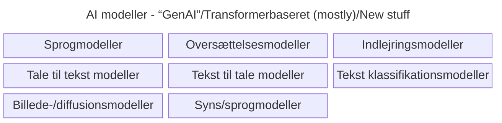
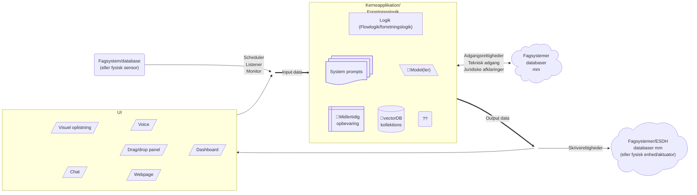

# Baggrund: Objekt for os2AI

_Formålet med dette skriv er at sætte en ramme for en diskussion hvad vi i os2AI fællesskabet mener når vi snakker om
"AI assistenter"/"AI specialister"/"AI løsninger", som vi gerne vil have at det produkt "os2AI", som vi i fællesskabet
udvikler skal understøtte_

Dette er også tænkt som baggrund for AIStorskala projektets spor 3, hvor der skal sættes minimumskrav til 
_"AI assistenter"_/_"AI specialister"_ (uden at begrebet/objektet er defineret og afgrænset nærmere). Dette skriv er
derfor et forsøg på at sætte en ramme for diskussion af hvordan objektet skal defineres og afgrænses, for derved at 
muliggøre en senere diskussion af minimumskrav til _"AI assistenter"_/_"AI specialister"_/eller-hvad-vi-nu-vil-kalde-det
for at vi meningsfuldt i det offerentlige, særligt kommunale, kan dele disse _"ting"_ med hinanden.

## Hvad dækker "AI" over

_AI_/Kunstig intelligens er et diffust begreb, hvilket gør det essentielt er blive skarpe på hvad vi i os2AI snakker om,
når vi snakker om AI for at undgå at tale forbi hinanden.

AI repræsenterer helt overordnet en underklasse under automatisering. 
AI er kendetegnet ved at [mennesker vurderer](## "dvs den fælles konsensus") at disse automatiseringer emulerer
noget som kun mennesker tidligere har kunnet gøre; eller som mennesker vurdere kræver menneskelig intelligens at udføre.

Da AI netop er en "maskine", vil AI'en demonsterer, at en maskine nu kan udføre de opgaver, som kun mennesker tidligere har 
kunnet udfører og med tiden vil det flytte den generelle konsensus, så det der tidligere blev betragtet som AI ikke 
nødvendigvis længere betragtes som AI og det der betragtes som AI i dag ikke nødvendigvis betragtes som AI om nogle år. 

Alan Türings klassiske karakteritisk af AI er, at hvis et menneske (lad os kalde hende Anne) og en maskine, som Anne 
ikke ved er en maskine (det kan være maskine bliver kaldt Bente i eksperimentet) har mulighed for at inteagere.
Hvis Anne ikke bliver klar over at Bente er er en maskine gennem deres inteaktionen, så besidder Bente, altså maskinen, 
kunstig intelligens. 

I EU definere vi "AI" lidt mindre malerisk jf AI Act'en, som:
> AI-system: et maskinbaseret system, som er udformet med henblik på at
fungere med en varierende grad af autonomi, og som efter idriftsættelsen
kan udvise en tilpasningsevne, og som til eksplicitte eller implicitte mål af
det input, det modtager, udleder, hvordan det kan generere output såsom
forudsigelser, indhold, anbefalinger eller beslutninger, som kan påvirke fy-
siske eller virtuelle miljøer.

## AI modeller

Centralt i diskussion står at AI løsningen, for at kunne kaldes _AI_, et eller andet sted benytter sig af en eller flere 
af de statistiske (maskin lærings-) modeller, der i daglig tale opfattes som _AI_, særligt _Generativ AI_ (vagt 
definineret som noget der _generere_ noget) eller _transformer_ baseret AI. 

> _Transformeren_ er en særlig arkitektur komponent i designet af maskin læringsmodeller, som er meget central i de 
_næsten_ alle moderne tekst genererende modeller (tranformeren bruges dog også i mange andre moderne AI-modeller, der 
ikke på samme måde kan siges at være generative). Transformeren blev defineret i 2018 og ses i udviklingsmiljøet for at 
være kilden til den nuværende AI-hype.

### Oversigt over AI modeller

Min egen top-of-head oversigt over de forskellige typer af moderne (transformer-baseret/generative) AI modeller.

Oversigt fra [huggingfaces klassifikation af modeller](./huggingface_ai_model_oversigt.md)

## AI løsning

_Her giver jeg mit personlige bud på hvad der udgør en AI løsning_

Det er essentielt at holde sig for øje at en AI løsning er meget mere end en AI model - uanset hvad man kalder den og 
hvordan vi senere afgrænser den undergruppe af løsninger vi vil beskæftige os med. 

- En AI løsning består af en kerne-applikation, der afspejler den forretningsgang den skal understøtte (eller udfører)
  - Kerne-applikation udgøres af den (maskinlæsbare) logik der implementere _forretnings_logikken
  - Alt efter hvordan det er nødvendigt, håndterer logikken kald af AI modeller, (vectordatabase) opslag, sammensætning 
    af prompts og hvad der ellers er nødvendigt for at løse usecasen i henhold til de kvalitetskrav der er sat
- Kerne-applikationen skal have et input og leverer et output
- Input og output kan komme fra og gå til en brugerflade
- Inputs kan også trigges af event i systemer
- Output kan også trigge ændringer i systemer

Da en moderne AI løsning ikke er umiddelbart gennemskuelig - i mange tilfælde vil samme input ikke nødvendigvis give 
samme output - er en AI løsning også defineret af de performance krav der er stillet til den og i høj grad hvordan man
har testet at løsningen lever op til de krav. Dette er essentiel information, hvis andre også skal kunne vurdere om de 
kan tage løsningen i brug.

### Konkrete eksempler på AI løsninger

- [Simple sprogmodel chat](./AI_loesningseksempler/simpleste_chat.md)
- [Søgning i byrådsreferater](./AI_loesningseksempler/soegning.md)
- [Dokument forståelse](./AI_loesningseksempler/doc_digestion.md) (Pt. kun chatgpt udkast - ikke gennemarbejdet/verificeret)
- [Agentisk RAG over vejledning til lønsystem](./AI_loesningseksempler/agentic_rag.md) (Pt. kun chatgpt udkast - ikke gennemarbejdet/verificeret)
- [Tolke løsning](./AI_loesningseksempler/tolkning.md) (Pt. kun chatgpt udkast - ikke gennemarbejdet/verificeret)
- [Aflæsning af bilag](./AI_loesningseksempler/bilagskontrol.md) (Pt. kun chatgpt udkast - ikke gennemarbejdet/verificeret)
- [Kontrol af konsistens i indkøbssystem](./AI_loesningseksempler/db_konsistens_kontrol.md) (Pt. kun chatgpt udkast - ikke gennemarbejdet/verificeret)

## Navngivning af AI løsninger

- ### Chatbots (Voice-bots)

  Kaldes også assistenter. Kendetegnet primært via UI'et/interaktionsformen: "Samtalebaseret" (skiftevis). 
  Oftest i tekst, men også muligt i tale. Kan være meget simpelt (beskeder sendes reletivt direkte fra UI til 
  sprogmodel, hvis output sendes tilbage til UI'et), men kan også indkoroperer en eller flere af de andre løsninger.
  
  Eksempler
  - [Le Chat](https://chat.mistral.ai)
  - [Chat GPT](https://chatgpt.com)

- ### Real-time samtale løsninger
  
  Som ovenfor, men med mulighed for at dialogdeltagerne (menneske og bot) kan tale ind over hinanden
  
  Eksempel:
  - [Moshi](https://moshi.chat/)
  
- ### Agenter
  
  AI løsninger/systemer der har mulighed for at _agere_ på eget initaitiv. __Bemærk__ (for det kan hurtigt komme til at 
  lyde dommedagsagtigt) at det altid kun er muligt for systemet at agere med de funktionaliter, der er defineret og 
  givet adgang til i designet af systemet. Dvs. AI'en kan kun gøre det vi giver den lov til. (Men det indebærer 
  selvfølgelig også en risici, hvis man giver forskellige værktøjer/adgange der, når de bruges sammen kan lede til 
  uhensigtsmæssige muligheder)

  - #### Tools
  
    En kodestump/et script der kan aktiveres i det logiske flow i en AI løsning, hvis AI modellen indikere at det skal
    aktiveres. Et tool vil typisk repræsentere en "normal" (ikke AI baseret) programmel handling, f.eks.:
  
    - Bruge en lommeregner til at regne noget sammen
    - Hente oplysninger fra en database
    - Oprette elementer i en database
    - Sende en e-mail
    - Udføre en API-anmodning 

    Resultatet af handlingen vil som oftest blive sendt til AI-modellen (i hvert fald hvis systemet det er bygget op 
    omkring en generativ sprogmodel).
  
  - #### Skills
  
    Et særligt sæt af instruktioner (en "prompt"-stump) eller flow af kald til (som oftest) sprogmodeller, der indikere
    hvordan en særlig subprocess skal udføres. Skills kan være:
  
    - Domænespecifikke (f.eks. juridisk analyse, medicinsk diagnose)
    - Opbygget som en række prompt-engineering-trin
    - Kombineret med eksterne værktøjer (f.eks. databaseopslag)

  - #### Subagent
    
    En agent der kan aktiveres af en anden agent.Subagenter bruges til at:

    - Delegere opgaver (f.eks. en hovedagent, der aktiverer en subagent til at håndtere en specifik opgave)
    - Parallelisere arbejde (f.eks. flere subagenter, der udfører forskellige opgaver samtidigt)
    - Specialisere funktioner (f.eks. en subagent til dataanalyse, en anden til rapportgenerering)

  Eksempler på agent systemer, kan strække sig fra meget lidt autonomi til alt for meget autonomi:
  
  - [n8n](https://n8n.io/ai/) - Automatiseringsframework, der også kan bruges til konstruere agentiske AI systemer/flow
    (Alternativ fokuseret AI: [Flowise](https://flowiseai.com/))
  - [Claude Code](https://claude.com/product/claude-code) - agentisk chatbot til programmører
  - [Open Claw](openclaw.ai) - helt ekstrem agent med personlighed
  - [Spacebot](https://spacebot.sh/) - måske lidt mere realistisk

- ### Dokumentforståelse/OCR

  Løsninger, der ekstraherer og fortolker struktureret information fra ustrukturerede dokumenter,
  herunder scannede papirdokumenter, PDF'er og billeder. Kombinerer ofte:

  - OCR (Optical Character Recognition) til at læse tekst
  - Identificere felter (fx CPR, datoer, beløb)
  - Forstå dokumenttype (fx ansøgning, afgørelse, faktura)
  - Udtrække struktureret data fra fritekst
  - Sammenfatte eller klassificere indhold
  
  Disse løsninger bruges ofte som forbehandling i større AI løsninger (fx før klassifikation eller RAG), 
  men kan også være selvstændige specialister i dokumenttunge arbejdsgange.

  Eksempler:
  - [Mistral Document AI](https://docs.mistral.ai/capabilities/document_ai)
  - [Docling](https://www.docling.ai/)
  
- ### Semantisk søgning og vector databaser
  
  Søgninger, der går ud over nøgleordsmatching ved at søge ud fra det semantiske indhold (betydningen) af en
  forespørgsel. Det fungerer ved brug af såkaldte indlejrings/embedding modeller, der gør det muligt at udtrykke orddele
  som matematiske vektorer. 
  
  I fremsøgningen benytter man specielle designs af databaser, der kan søge blandt vektorer, såkaldte vektordatabaser.

  Alle moderne søgemotorer (google, DuckduckGo osv) benytter sig blandt andet af semantisk søgning. 
  Vectordatabaser understøttes blandt andet af qdrant, ElasticSearch, Postgress osv.
  
- ### MCP

  MCP (Model Context Protocol) er en arkitekturmæssig tilgang til at standardisere hvordan en AI-model
  får adgang til kontekst og værktøjer (oftest fra eksterne ressourcer). Det er en slags integrations- og 
  arkitekturstandard. 

  I forhold til borgere og det offentlige kunne 
  borger.dk eller sundhed.dk tænkes at stille MCP servere til rådighed, så borgeres personlige AI-løsninger vil kunne
  tilgå den specifikke borgers egne oplysninger direkte. 

- ### RAG (Retrieval-Augmented Generation)

  En arkitektur, der kombinerer:
  - Retrieval: Hentning af relevant information fra en ekstern kilde, f.eks. et database opslag (måske fra en vektordatabase)
  - Augmented Generation: Generering af svar baseret på både den hentede information og AI-modellens evne til at sammensætte denne. 
  
- ### Billedgenerering

  AI-løsninger, der genererer billeder ud fra tekstbeskrivelser (text-to-image) eller transformerer eksisterende billeder.
  Teknologier inkluderer:
  - Diffusionsmodeller f.eks. [Stable Diffusion](https://stability.ai/)
  - GANs: Generative Adversarial Networks
  - Autoregressive modeller (f.eks. [DALL·E](https://openai.com/dall-e-3))

- ### Diktering/transcribtion

  Løsninger der konverterer tale til tekst (speech-to-text).
  
  Kan være:
  - Real-time (løbende under samtale)
  - Batch (optagelse behandles efterfølgende)
  
  Anvendes fx til:
  - Referatskrivning
  - Journalisering
  - Dokumentation af samtaler
  
  Kan kombineres med:
  - Automatisk opsummering
  - Strukturering i skabeloner
  - Klassifikation
