# Baggrund: Objekt for os2AI

_Formålet med dette skriv er at sætte en ramme for en diskussion hvad vi i os2AI fællesskabet mener når vi snakker om
"AI assistenter"/"AI specialister"/"AI løsninger", som vi gerne vil have at det produkt "os2AI", som vi i fællesskabet
udvikler skal understøtte_

Dette er også tænkt som baggrund for AIStorskala projektets spor 3, hvor der skal sættes minimumskrav til 
_"AI assistenter"_/_"AI specialister"_ (uden at begrebet/objektet er defineret og afgrænset nærmere). Dette skriv er
derfor et forsøg på at sætte en ramme for diskussion af hvordan objektet skal defineres og afgrænses, for derved at 
muliggøre en senere diskussion af minimumskrav til _"AI assistenter"_/_"AI specialister"_/eller-hvad-vi-nu-vil-kalde-det
for at vi meningsfuldt i det offerentlige, særligt kommunale, kan dele disse _"ting"_ med hinanden.

## AI modeller

Centralt i diskussion står at AI løsningen for at kunne kaldes _AI_ et eller andet sted benytter sig af en eller flere 
af de statistiske (maskin lærings-) modeller, der i daglig tale opfattes som _AI_, særligt _Generativ AI_ (vagt 
definineret som noget der _generere_ noget) eller _transformer_ baseret AI. 

> _Transformeren_ er en særlig arkitektur komponent i designet af maskin læringsmodeller, som er meget central i de 
_næsten_ alle moderne tekst genererende modeller (tranformeren bruges dog også i mange andre moderne AI-modeller, der 
ikke på samme måde kan siges at være generative). Transformeren blev defineret i 2018 og ses i udviklingsmiljøet for at 
være kilden til den nuværende AI-hype.

### Oversigt over AI modeller

Min egen top-of-head oversigt over de forskellige typer af moderne (transformer-baseret/generative) AI modeller.

Oversigt fra [huggingfaces klassifikation af modeller](./huggingface_ai_model_oversigt.md)

## AI løsning

_Her giver jeg mit personlige bud på hvad der udgør en AI løsning_

```mermaid
flowchart LR
    classDef inViz fill:None,stroke-width:0px;
    inVizStart:::inViz@{shape: junction}
    inVizEnd:::inViz@{shape: junction}

    subgraph coreapp["`Kerneapplikation/
                        Forretningslogik`"]
        direction TB
        logik["`Logik (Flowlogik/forretningslogik)`"]
        models@{ shape: lean-l, label: "🔌Model(ler)" }
        prompts@{ shape: docs, label: "System prompts" }
        tables@{ shape: db, label: "🔌vectorDB\n kollektions"}
        storage@{ shape: win-pane, label: "🔌Midlertidig\n opbevaring" }
        other@{ shape: rounded, label: "??"}

        %% Arrange components within coreapp with invisible links %%
        %% This reflects no logic %%
        %% vertical links %%
        logik ~~~ prompts ~~~ storage
                  prompts ~~~ tables
        logik ~~~ models ~~~ tables 
                  models ~~~ other

    end

    inVizStart =="Input data"==> coreapp
    
    systems@{ shape: cloud, label: "Fagsystemer
              databaser
              mm"}
    
    coreapp <--"Adgangsrettigheder
                Teknisk adgang
                Juridiske afklaringer"--> systems

    coreapp =="Output data"==> inVizEnd

    subgraph ui["UI"]
        direction LR
        ui_chat@{ shape: in-out, label: "Chat"}
        ui_panel@{ shape: in-out, label: "Drag/drop panel"}
        ui_web@{ shape: in-out, label: "Webpage"}
        ui_voice@{ shape: in-out, label: "Voice"}
        ui_viz@{ shape: in-out, label: "Visuel oplistning"}
        ui_board@{ shape: in-out, label: "Dashboard"}

        %% Arrange components within coreapp with invisible links %%
        %% This reflects no logic %%
        inVizAnchor[" "]:::inViz
        %% pairwise linking %%
        inVizAnchor ~~~ ui_viz ~~~ ui_voice ~~~ ui_board
                        ui_viz ~~~ ui_panel ~~~ ui_board
        inVizAnchor ~~~ ui_chat ~~~ ui_panel ~~~ ui_board
                        ui_chat ~~~ ui_web ~~~ ui_board
    end

    out_systems@{ shape: cloud, label: "Fagsystemer/ESDH
                databaser mm 
                (eller fysisk enhed*)"}
    
    inVizEnd --"Skriverettigheder"--> out_systems
    inVizEnd --> ui
    ui --> inVizStart

    altInput@{ shape: event, label: "Fagsystem/database 
    (eller fysisk sensor)" } --"Scheduler
                                Listener
                                Monitor"-->inVizStart

```

