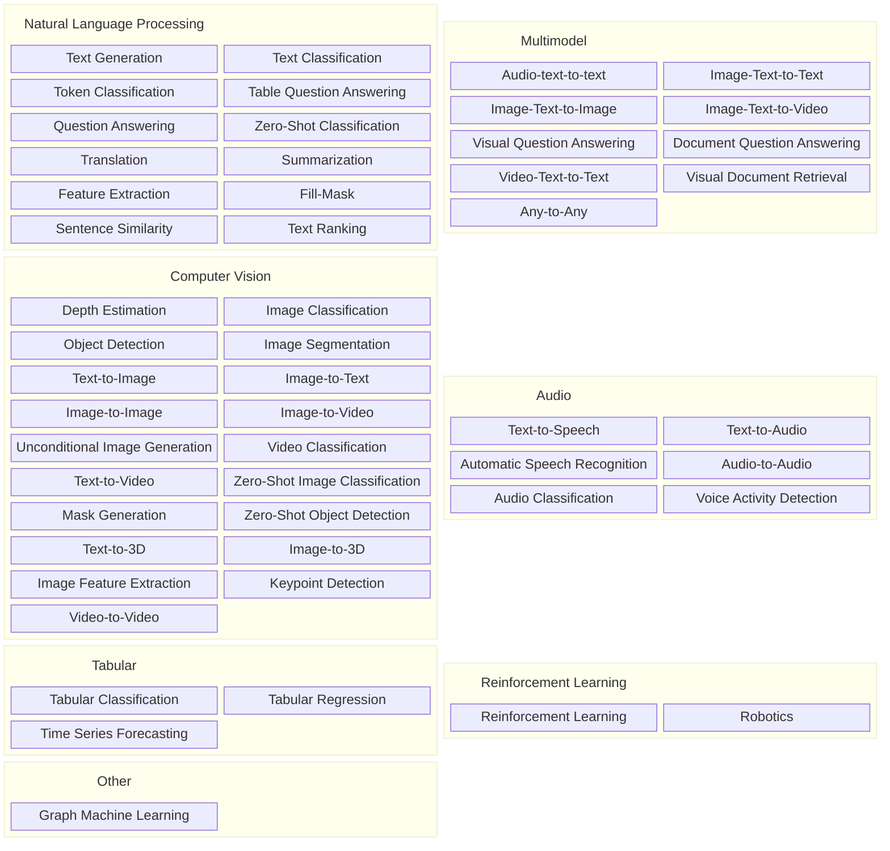
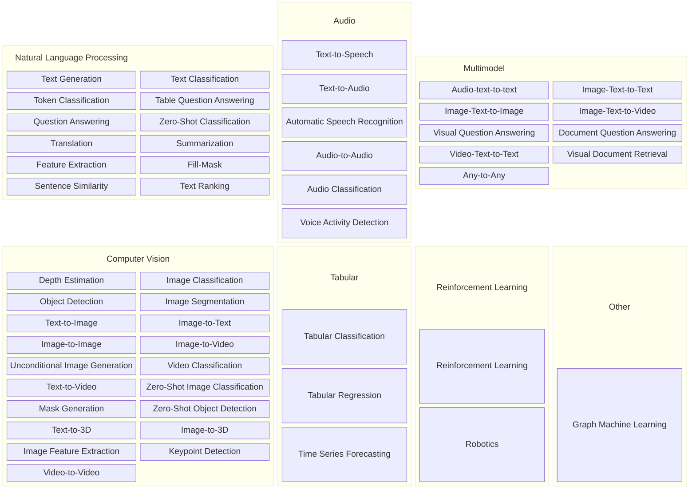

# Klassifikation af AI Modeller

Oversigt fra [huggingfaces klassifikation af modeller](https://huggingface.co/models?sort=trending)

#TODO: Add explanation to most significant models classes (and reorder so to have most important first)

